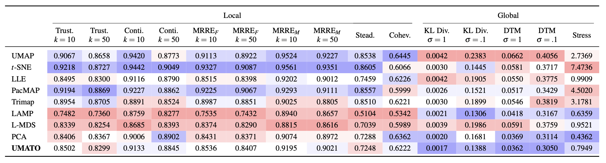
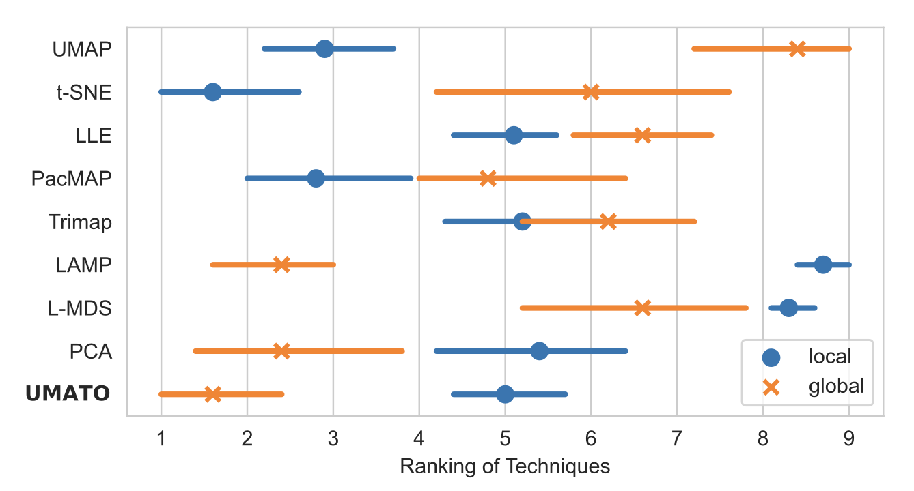
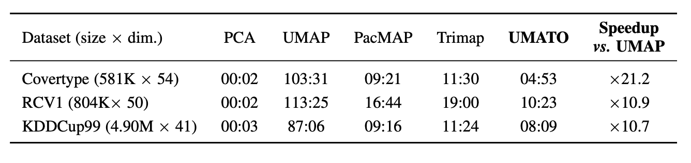
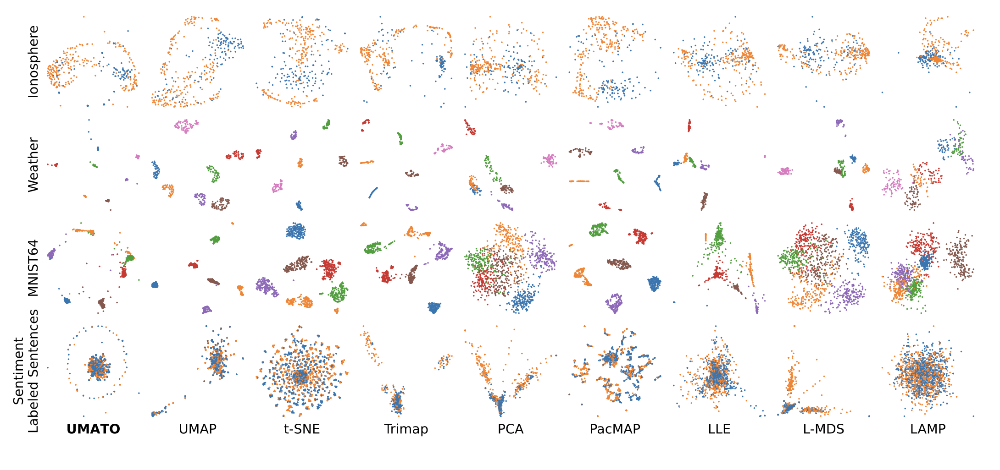
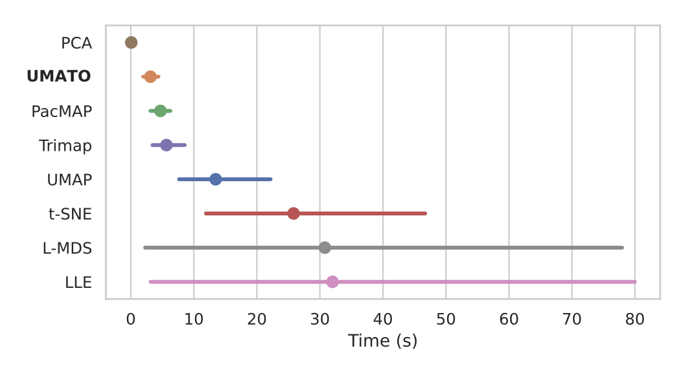

<p align="center">
  <h2 align="center">UMATO</h2>
	<h3 align="center">Uniform Manifold Approximation with Two-phase Optimization</h3>
</p>

---


Uniform Manifold Approximation with Two-phase Optimization (UMATO) is a dimensionality reduction technique, which can preserve the global as well as the local structure of high-dimensional data. Most existing dimensionality reduction algorithms focus on either of the two aspects, however, such insufficiency can lead to overlooking or misinterpreting important global patterns in the data. Moreover, the existing algorithms suffer from instability. 
To address these issues, UMATO proposes a two-phase optimization: global optimization and local optimization. First, we obtain the global structure by selecting and optimizing the hub points.
Next, we initialize and optimize other points using the nearest neighbor graph. Our experiments with one synthetic and three real world datasets show that UMATO can outperform the baseline algorithms, such as PCA, [t-SNE](https://lvdmaaten.github.io/tsne/), [Isomap](https://scikit-learn.org/stable/modules/generated/sklearn.manifold.Isomap.html), [UMAP](https://github.com/lmcinnes/umap), [LAMP](https://github.com/lgnonato/LAMP) and [PacMAP](https://github.com/YingfanWang/PaCMAP), in terms of accuracy, stability, and scalability.

## System Requirements
- Python 3.9 or greater
- scikit-learn
- numpy
- scipy
- numba

## Installation 

UMATO is available via pip.

```sh
pip install umato
```

```python
import umato
from sklearn.datasets import load_iris

X, y = load_iris(return_X_y=True)
emb = umato.UMATO(hub_num=50).fit_transform(X)
```

For detailed information on the algorithm and parameter usage, check the [API documentation](https://github.com/hyungkwonko/umato/wiki/API) listed under the Wiki.

## Findings

Detailed statistical data supporting our findings in accuracy and scalability analyses are presented in the figures below:

#### Figure 1: Accuracy Analysis between Dimensionality Reduction Techniques
  
The average scores that nine DR techniques obtain in the accuracy analysis. For each quality metric, DR techniques ranked in the first--fourth place are highlighted in blue, where we assign higher opacity to the better techniques. Similarly, techniques ranked in the six--ninth place are highlighted in red, where worse techniques have higher opacity. UMATO substantially outperforms baselines in terms of global metrics with a slight sacrifice in local metric scores. Note that we standardize both the original data and projections to minimize the impact of scaling.

#### Figure 2: Local and Global Metric Rankings
<div align="center">
    
</div>  
Ranking of DR techniques determined by local and global quality metrics in accuracy analysis. Among the nine techniques we compared, UMATO demonstrated the highest accuracy in terms of global metrics and ranked fourth in local metrics. The error bars depict 95% confidence interval.

#### Figure 3: Scalability with Large Datasets
<div align="center">
    
</div>  
The results of the scalability analysis with large datasets. The number of points (size) and dimensionality (dim.) are depicted on the left side of each dataset’s name. We depict the runtime of each DR technique in mm:ss format. UMATO outperformed every competitor except PCA, with an average speedup of ×14.3 over UMAP.

#### Figure 4: Projection Subset Analysis
  
The subset of the projections generated in our accuracy analysis. Colors depict the class label of each dataset. The analysis results verified that UMATO outperforms competitors in terms of accurately preserving global structure while maintaining competitive performance in depicting local structure.

#### Figure 5: Scalability with Small Datasets
<div align="center">
    
</div>  
The results of the scalability analysis with small datasets. Note that LAMP has been removed from the figure as it is needs substantially long computation time, making the runtime of all other techniques look similar. UMATO takes about three seconds on average to generate projections, outperforming all other nonlinear DR techniques. The error bars depict confidence intervals (95%)


## Citation

UMATO can be cited as follows:

```bibtex
@inproceedings{jeon2022vis,
  title={Uniform Manifold Approximation with Two-phase Optimization},
  author={Jeon, Hyeon and Ko, Hyung-Kwon and Lee, Soohyun and Jo, Jaemin and Seo, Jinwook},
  booktitle={2022 IEEE Visualization and Visual Analytics (VIS)},
  pages={80--84},
  year={2022},
  organization={IEEE}
}
```

Jeon, H., Ko, H. K., Lee, S., Jo, J., & Seo, J. (2022, October). Uniform Manifold Approximation with Two-phase Optimization. In 2022 IEEE Visualization and Visual Analytics (VIS) (pp. 80-84). IEEE.
