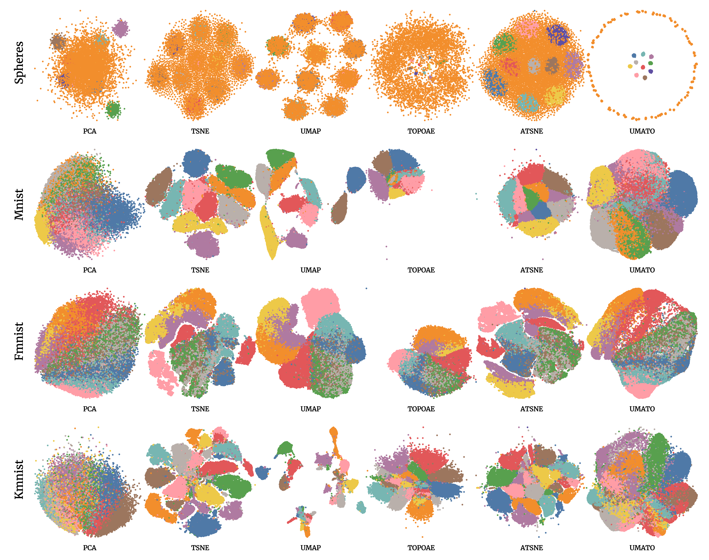

# Uniform Manifold Approximation with Two-phase Optimization

Uniform Manifold Approximation with Two-phase Optimization (UMATO) is a dimensionality reduction technique, which can preserve the global as well as the local structure of high-dimensional data. Most existing dimensionality reduction algorithms focus on either of the two aspects, however, such insufficiency can lead to overlooking or misinterpreting important patterns in the data. For this aim, we propose a two-phase optimization: global optimization and local optimization. First, we obtain the global structure by selecting and optimizing the hub points.
Next, we initialize and optimize other points using the nearest neighbor graph. Our experiments with one synthetic and three real world datasets show that UMATO can outperform the baseline algorithms, such as PCA, t-SNE, [UMAP](https://github.com/lmcinnes/umap), [Topological Autoencoders](https://github.com/BorgwardtLab/topological-autoencoders) and [Anchor t-SNE](https://github.com/ZJULearning/AtSNE), in terms of global measures and qualitative projection results.

### System Requirements
- Python 3.6 or greater
- scikit-learn
- numpy
- scipy
- numba
- pandas (to read csv data)

## Run
You can try the following code to see the result:
```python
# install requirements
pip install scikit-learn numpy numba pandas

# download specific (e.g., MNIST) datasets
bash download.sh mnist

# run UMATO
python test.py --data=mnist
```

# Evaluation

## Training models & Generating embedding result
We will generate embedding results for each algorithm for the comparison. The algorithms we will use are the following:
- t-SNE
- [UMAP](https://github.com/lmcinnes/umap)
- [Topological Autoencoder](https://github.com/BorgwardtLab/topological-autoencoders)
- [Anchor t-SNE](https://github.com/ZJULearning/AtSNE)
- UMATO (ours)

We can run each method separately, or all of them at once.
```python
# run all datasets
bash run-benchmark.sh

# run specific dataset (e.g., MNIST dataset)
bash run-benchmark.sh mnist
```
This will cover PCA, t-SNE, UMAP and Topological Autoencoders. To run Anchor t-SNE, you need CUDA and GPU. Please refer to [here](https://github.com/ZJULearning/AtSNE) for specification.


## Qualitative evaluation
For the qualitative evaluation, we can compare the 2D visualization of each algorithm. We used the [svelte web framework](https://svelte.dev/) and [d3](https://d3js.org/) for the visualization.

```python
# see visualization
cd visualization

# run svelte app
npm run dev
```

### Embedding results of four datasets for each algorithm:

|             2D visualization           |
|:--------------------------------------:|
|


## Quantitative evaluation
Likewise, we compared the embedding result quantitatively. We use measures such as Distance to a measure and KL divergence between density distributions for comparison.

To print the quantitative result:
```python
# print table result
python -m evaluation.comparison --algo=all --data=spheres --measure=all
```

### Result for the Spheres dataset

|                     |  PCA   | t-SNE  |  UMAP  | TopoAE | At-SNE |  UMATO (ours) |
| :-----------------: | :----: | :----: | :----: | :----: | :----: | :-----------: |
| DTM                 | 0.9680 | 0.9116 | 0.9209 | 0.6619 | 0.9448 | __0.3849__    |
| KL-Div (sigma=0.01) | 0.7385 | 0.6070 | 0.6100 | 0.1865 | 0.6584 | __0.1569__    |
| KL-Div (sigma=0.1)  | 0.5987 | 0.5365 | 0.5383 | 0.3007 | 0.5712 | __0.1333__    |
| KL-Div (sigma=1.)   | 0.0125 | 0.0128 | 0.0134 | 0.0057 | 0.0138 | __0.0008__    |

- DTM: & KL divergence: Lower is better


## References
- Maaten, L. V. D., & Hinton, G. (2008). Visualizing data using t-SNE. JMLR, 9(Nov), 2579-2605.
- McInnes, L., Healy, J., & Melville, J. (2018). Umap: Uniform manifold approximation and projection for dimension reduction. arXiv preprint arXiv:1802.03426.
- Moor, M., Horn, M., Rieck, B., & Borgwardt, K. (2020). Topological autoencoders. ICML.
- Fu, C., Zhang, Y., Cai, D., & Ren, X. (2019, July). AtSNE: Efficient and Robust Visualization on GPU through Hierarchical Optimization. In Proceedings of the 25th ACM SIGKDD International Conference on Knowledge Discovery & Data Mining (pp. 176-186).