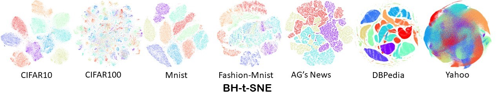
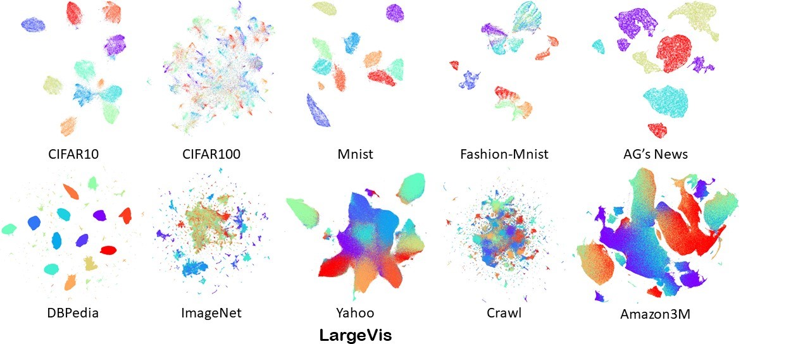
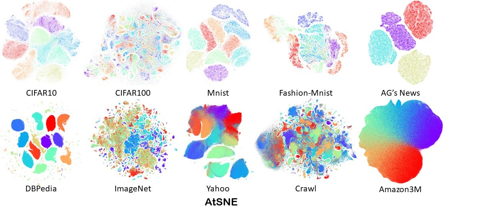

# AtSNE
AtSNE is a solution of high-dimensional data visualization problem. It can project large-scale high-dimension vectors into low-dimension space while keeping the pair-wise similarity amount point. AtSNE is efficient and scalable and can visualize 20M points in less than 5 hours using GPU. The spatial structure of its result is also robust to random initializations.
It implements the algorithm of our KDD'19 paper - [AtSNE: Efficient and Robust Visulization on GPU through Hierarchical Optimization](http://downloads.zjulearning.org.cn/atsne/AtSNE.pdf)

## Benchmark datasets
| Dataset       | Dimensions | Number of Points | Number of Categories | Data                                                                                                                                                                                        | Label                                                                                                                                                                                         |
|---------------|------------|------------------|----------------------|---------------------------------------------------------------------------------------------------------------------------------------------------------------------------------------------|-----------------------------------------------------------------------------------------------------------------------------------------------------------------------------------------------|
| CIFAR10       | 1024       | 60,000           | 10                   | [.txt](http://downloads.zjulearning.org.cn/atsne/cifar10_data.txt) [.fvces](http://downloads.zjulearning.org.cn/atsne/cifar10_data.txt.fvecs)                                       | [.txt](http://downloads.zjulearning.org.cn/atsne/cifar10_label.txt) [.ivces](http://downloads.zjulearning.org.cn/atsne/cifar10_label.txt.ivecs)                                       |
| CIFAR100      | 1024       | 60,000           | 100                  | [.txt](http://downloads.zjulearning.org.cn/atsne/cifar100_data.txt) [.fvces](http://downloads.zjulearning.org.cn/atsne/cifar100_data.txt.fvecs)                                     | [.txt](http://downloads.zjulearning.org.cn/atsne/cifar100_label.txt) [.ivces](http://downloads.zjulearning.org.cn/atsne/cifar100_label.txt.ivecs)                                     |
| MNIST         | 784        | 70,000           | 10                   | [.txt](http://downloads.zjulearning.org.cn/atsne/mnist_vec784D_data.txt) [.fvces](http://downloads.zjulearning.org.cn/atsne/mnist_vec784D_data.txt.fvecs)                           | [.txt](http://downloads.zjulearning.org.cn/atsne/mnist_vec784D_label.txt) [.ivces](http://downloads.zjulearning.org.cn/atsne/mnist_vec784D_label.txt.ivecs)                           |
| Fashion-MNIST | 784        | 70,000           | 10                   | [.txt](http://downloads.zjulearning.org.cn/atsne/fashion_mnist_data.txt) [.fvces](http://downloads.zjulearning.org.cn/atsne/fashion_mnist_data.txt.fvecs)                           | [.txt](http://downloads.zjulearning.org.cn/atsne/fashion_mnist_label.txt) [.ivces](http://downloads.zjulearning.org.cn/atsne/fashion_mnist_label.txt.ivecs)                           |
| AG’s News     | 100        | 120,000          | 4                    | [.txt](http://downloads.zjulearning.org.cn/atsne/agnews_data.txt) [.fvces](http://downloads.zjulearning.org.cn/atsne/agnews_data.txt.fvecs)                                         | [.txt](http://downloads.zjulearning.org.cn/atsne/agnews_label.txt) [.ivces](http://downloads.zjulearning.org.cn/atsne/agnews_label.txt.ivecs)                                         |
| DBPedia       | 100        | 560,000          | 14                   | [.txt](http://downloads.zjulearning.org.cn/atsne/dbpedia_data.txt) [.fvces](http://downloads.zjulearning.org.cn/atsne/dbpedia_data.txt.fvecs)                                       | [.txt](http://downloads.zjulearning.org.cn/atsne/dbpedia_label.txt) [.ivces](http://downloads.zjulearning.org.cn/atsne/dbpedia_label.txt.ivecs)                                       |
| ImageNet      | 128        | 1,281,167        | 1000                 | [.txt](http://downloads.zjulearning.org.cn/atsne/imagenet_data.txt) [.fvces](http://downloads.zjulearning.org.cn/atsne/imagenet_data.txt.fvecs)                                     | [.txt](http://downloads.zjulearning.org.cn/atsne/imagenet_label.txt) [.ivces](http://downloads.zjulearning.org.cn/atsne/imagenet_label.txt.ivecs)                                     |
| Yahoo         | 100        | 1,400,000        | 10                   | [.txt](http://downloads.zjulearning.org.cn/atsne/yahoo_data.txt.gz) [.fvces](http://downloads.zjulearning.org.cn/atsne/yahoo_data.txt.fvecs)                                        | [.txt](http://downloads.zjulearning.org.cn/atsne/yahoo_label.txt) [.ivces](http://downloads.zjulearning.org.cn/atsne/yahoo_label.txt.ivecs)                                           |
| Crawl         | 300        | 2,000,000        | 10                   | [.txt](http://downloads.zjulearning.org.cn/atsne/crawl_data.txt.gz) [.fvces](http://downloads.zjulearning.org.cn/atsne/crawl_data.txt.fvecs.gz)                                     | [.txt](http://downloads.zjulearning.org.cn/atsne/crawl_label.txt) [.ivces](http://downloads.zjulearning.org.cn/atsne/crawl_label.txt.ivecs)                                           |
| Amazon3M      | 100        | 3,000,000        | 5                    | [.txt](http://downloads.zjulearning.org.cn/atsne/amazon_data.txt.gz) [.fvces](http://downloads.zjulearning.org.cn/atsne/amazon_data.txt.fvecs.gz)                                   | [.txt](http://downloads.zjulearning.org.cn/atsne/amazon_label.txt) [.ivces](http://downloads.zjulearning.org.cn/atsne/amazon_label.txt.ivecs)                                         |
| Amazon20M     | 96         | 19,531,329       | 5                    | [.txt](http://downloads.zjulearning.org.cn/atsne/amazon_reviews_us_Books_data.txt.gz) [.fvces](http://downloads.zjulearning.org.cn/atsne/amazon_reviews_us_Books_data.txt.fvecs.gz) | [.txt](http://downloads.zjulearning.org.cn/atsne/amazon_reviews_us_Books_label.txt.gz) [.ivces](http://downloads.zjulearning.org.cn/atsne/amazon_reviews_us_Books_label.txt.ivecs.gz) |

* *Details of dataset pre-processing are provided in our papers*

## Visualization Examples





## Performance

Compared Algorithms:

 - [LargeVis](https://github.com/lferry007/LargeVis)
 - [BH-t-SNE](https://github.com/DmitryUlyanov/Multicore-TSNE)
 - [TSNE-CUDA](https://github.com/CannyLab/tsne-cuda)


| Dataset       | method    | 10-NN accuracy | time     | Memory (GB) | speedup |
|---------------|-----------|----------------|----------|-------------|---------|
| CIFAR10       | BH-t-SNE  | 0.966          | 5m12s    | 2.61        | 1.6     |
|               | LargeVis  | 0.965          | 8m23s    | 7.90        | 1.0     |
|               | tsne-cuda | 0.963          | 27.7s    | 2.17        | 18.1    |
|               | AtSNE     | 0.957          | 19.6s    | 0.93        | 25.7    |
| CIFAR100      | BH-t-SNE  | 0.636          | 9m51s    | 2.62        | 0.9     |
|               | LargeVis  | 0.607          | 8m50s    | 7.90        | 1.0     |
|               | tsne-cuda | 0.646          | 28.3s    | 2.33        | 18.7    |
|               | AtSNE     | 0.600          | 19s      | 0.93        | 27.9    |
| MNIST         | BH-t-SNE  | 0.970          | 5m20s    | 2.35        | 1.7     |
|               | LargeVis  | 0.966          | 8m59s    | 7.15        | 1.0     |
|               | tsne-cuda | 0.968          | 31.3s    | 2.33        | 14.7    |
|               | AtSNE     | 0.967          | 19.6s    | 0.93        | 27.5    |
| Fashion-MNIST | BH-t-SNE  | 0.821          | 3m46s    | 2.28        | 2.3     |
|               | LargeVis  | 0.797          | 8m30s    | 7.18        | 1.0     |
|               | tsne-cuda | 0.827          | 31.1s    | 2.17        | 16.4    |
|               | AtSNE     | 0.822          | 19.9s    | 0.93        | 25.6    |
| AG’s News     | BH-t-SNE  | 0.993          | 5m30s    | 0.95        | 1.9     |
|               | LargeVis  | 0.994          | 10m37s   | 2.65        | 1.0     |
|               | tsne-cuda | 0.993          | 39.3s    | 2.17        | 16.2    |
|               | AtSNE     | 0.995          | 23s      | 0.88        | 27.7    |
| DBPedia       | BH-t-SNE  | 0.993          | 36m8s    | 4.22        | 0.93    |
|               | LargeVis  | 0.999          | 33m43s   | 12.71       | 1.0     |
|               | tsne-cuda | -              | -        | -           |         |
|               | AtSNE     | 0.999          | 3m       | 2.03        | 11.2    |
| ImageNet      | BH-t-SNE  | 0.412          | 4h7m53s  | 10.8        | 0.3     |
|               | LargeVis  | 0.608          | 1h18m45s | 53.09       | 1.0     |
|               | tsne-cuda | -              | -        | -           |         |
|               | AtSNE     | 0.649          | 11m53s   | 4.01        | 6.6     |
| Yahoo         | BH-t-SNE  | 0.537          | 2h17m17s | 10.47       | 0.62    |
|               | LargeVis  | 0.775          | 1h25m17s | 49.99       | 1.0     |
|               | tsne-cuda | –              | –        | –           |         |
|               | AtSNE     | 0.780          | 12m52s   | 4.27        | 6.6     |
| Crawl         | BH-t-SNE  | -              | >24h     | –           |         |
|               | LargeVis  | 0.688          | 2h34m14s | 139.05      | 1.0     |
|               | tsne-cuda | -              | –        | –           |         |
|               | AtSNE     | 0.692          | 30m1s    | 7.19        | 5.1     |
| Amazon3M      | BH-t-SNE  | -              | > 24h    | -           |         |
|               | LargeVis  | 0.606          | 2h53m25s | 104         | 1.0     |
|               | tsne-cuda | -              | -        | –           |         |
|               | AtSNE     | 0.603          | 34m4s    | 7.98        | 5.1     |
| Amazon20M     | BH-t-SNE  | -              | -        | -           |         |
|               | LargeVis  | -              | -        | -           |         |
|               | tsne-cuda | -              | -        | -           |         |
|               | AtSNE     | 0.755          | 4h54m    | 19.70       |         |

- Tested on i9-7980XE (18Cores, 36 Threads) with 128GB Memory
- AtSNE and TSNE-CUDA use one GTX 1080Ti GPU
- BH-t-SNE and LargeVis use 32 threads in the table above
- `-` means this method crashed in testing progress, mostly because of memory issues
- Tested version of LargeVis, BH-t-SNE and TSNE-CUDA are [feb8121](https://github.com/lferry007/LargeVis/tree/feb8121e8eb9652477f7f564903d189ee663796f), [62dedde](https://github.com/DmitryUlyanov/Multicore-TSNE/tree/62dedde52469f3a0aeb22fdd7bce2538f17f77ef) and  [efa2098](https://github.com/CannyLab/tsne-cuda/tree/efa209834879bba88814e74d7062539f4de07cc2) respectively
- For Amazon20M dataset which is too large to fit in memory, we use Product Quantization to build KNN graph. AtSNE use extra parameters `-k 50 --ivfpq    1 --subQuantizers 24 --bitsPerCode 8`.
- AtSNE just use the default parameters in the test above, except `--n_negative 400`. Exact parameters of aforementioned result are provided below in case you need it.

> --lr 0.05 --vis_iter 2000 --save_interval 0 -k 100 --clusters 1000 --n_negative 400 --center_number 5 --nprobe 50 --knn_negative_rate 0 -p 50 --early_pull_rate 20 --center_pull_iter 500 --early_pull_iter 1000 --scale 10  --center_perplexity 70 --center_grad_coeff 1


## How to use

### Requirement

- CUDA (8 or later), nvcc and cublas included
- gcc
- [faiss](https://github.com/facebookresearch/faiss)

### Compile

1. Clone this project
2. init submodule (cmdline and faiss)
    - enter the project root directory
    - run `git submodule init; git submodule update`
3. Compile faiss, enter directory of faiss (`vendor/faiss`), and follow [Step1](https://github.com/facebookresearch/faiss/blob/master/INSTALL.md#step-1-compiling-the-c-faiss) and [Step3](https://github.com/facebookresearch/faiss/blob/master/INSTALL.md#step-3-compiling-the-gpu-implementation), confirm that `vendor/faiss/libfaiss.a` and `vendor/faiss/gpu/libgpufaiss.a` is generated. Simplified instructions are shown below:
    - install required BLAS library (MKL, openblas): `sudo apt install libopenblas-dev`
    - `cd vender/faiss`
    - build faiss cpu library: `./configure && make -j8`
    - build faiss gpu library: `cd gpu; make -j`
4. enter project root directory, run `make -j`


### Run

```
./qvis_gpu -b mnist_vec784D_data.txt.fvecs -o mnist_result.txt
```

We choose good default parameters for you. And there are many other parameters you can change. If you want to reproduce the test in our KDD paper, please add `--n_negative 400`.


```
./qvis_gpu -b mnist_vec784D_data.txt.fvecs --n_negative 400 -o mnist_result.txt
```

ivecs/fvecs vector file formats are defined [here](http://corpus-texmex.irisa.fr/)

### Supplementary tools
There are some supplementary tools we use during developing/debugging/experimentation

- `tools/view.py` Draw the result in 2D space and save images for you.
- Label file is optional.
- Use multi-process to draw images for results with the same filename-prefix
- `tools/txt_to_fvecs.py` covert txt file, like result of largevVis or label file, to ivecs/fvecs
- `tools/largevis_convert.py` convert dataset of fvecs/ivecs to largeVis input format
- `tools/imagenet_infer.py` generate 128D imagenet feature vectors from ImageNet dataset
- `tools/box_filter.py` Give a bounding-box, print the points and corresponding labels. Used for case-study in our paper
- `test_knn_accuracy` (Build required) Test knn classifier accuracy(label needed) of visualization result
- `test_top1_error` (Build required) Test top-1 error of visualization result. The top-1 error is the ratio that the nearest neighbor of one point in low-dimension is not the nearest neighbor in high-dimension
